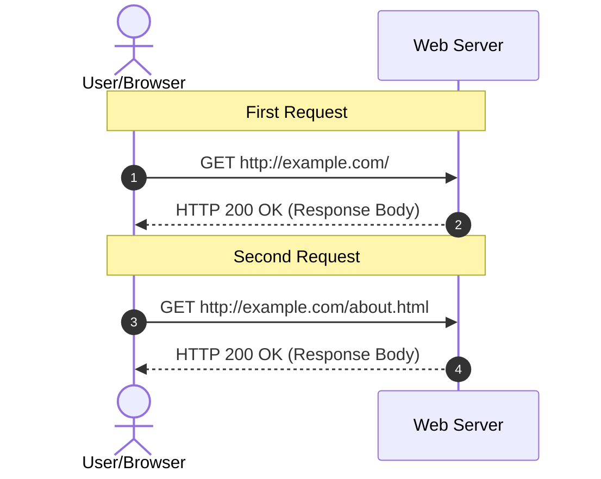
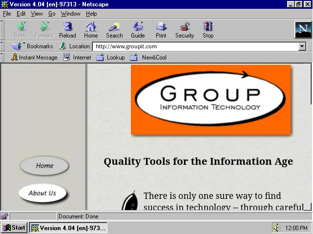
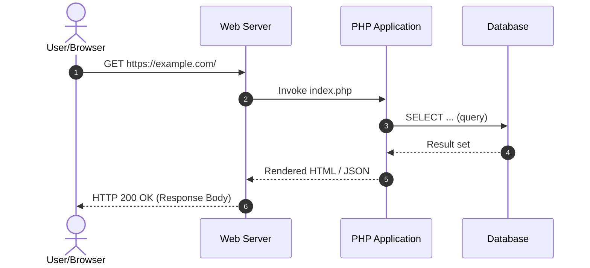
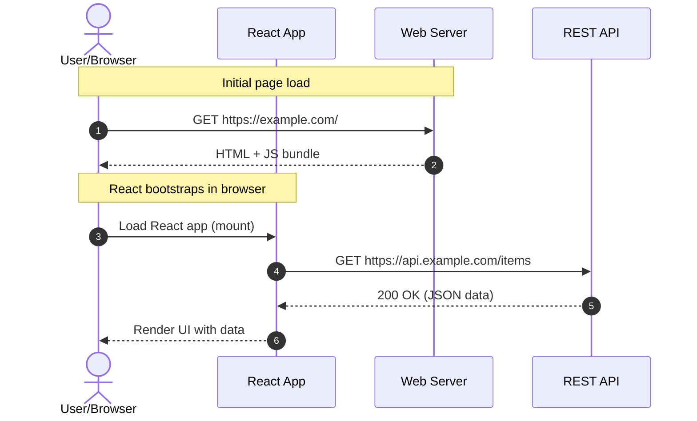
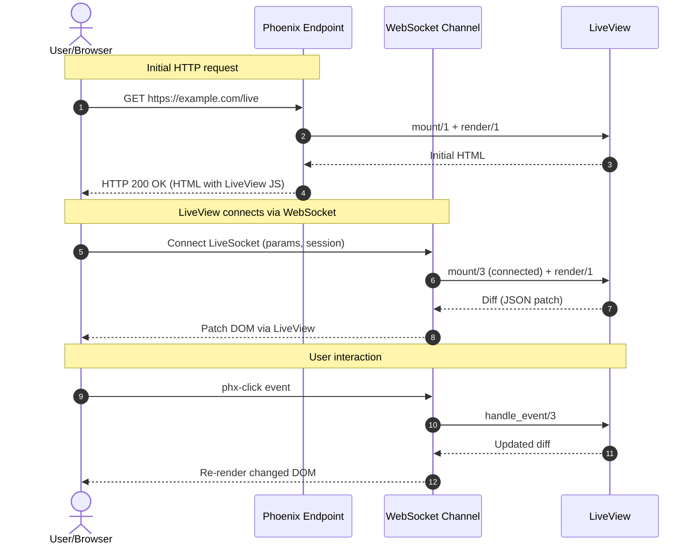

---
# try also 'default' to start simple
theme: seriph
# random image from a curated Unsplash collection by Anthony
# like them? see https://unsplash.com/collections/94734566/slidev
background: ./images/pavel-nekoranec-59Q73nuTqeo-unsplash.jpg
# some information about your slides (markdown enabled)
title: The LiveView Pattern
info: Presentation for js-montreal
# apply UnoCSS classes to the current slide
class: text-center text-shadow-lg
# https://sli.dev/features/drawing
drawings:
  persist: false
# slide transition: https://sli.dev/guide/animations.html#slide-transitions
transition: slide-left
# enable MDC Syntax: https://sli.dev/features/mdc
mdc: true
# duration of the presentation
duration: 35min
hideInToc: true
---

# The LiveView Pattern

## (And a brief history of the web)

<div class="abs-br m-6 text-xl">
  <button @click="$slidev.nav.openInEditor()" title="Open in Editor" class="slidev-icon-btn">
    <carbon:edit />
  </button>
  <a href="https://github.com/slidevjs/slidev" target="_blank" class="slidev-icon-btn">
    <carbon:logo-github />
  </a>
</div>

<!--
The last comment block of each slide will be treated as slide notes. It will be visible and editable in Presenter Mode along with the slide. [Read more in the docs](https://sli.dev/guide/syntax.html#notes)
-->

---
layout: section
---

# Introduction

---
level: 2
---

# About you?

<v-clicks>

  - Assume: Some knowledge of how the web works, JavaScript, and JSON.
  - Q: Who has hand coded a web page with just HTML and CSS?
  - Q: Who has developed an interactive web application **without** front-end JavaScript? EG: plain PHP.
  - Q: What's a pixel shim?

</v-clicks>

---
level: 2
---

# About Me

Most important fact for this presentation: 

- I started my career before the web existed.
- I have built web sites and web applications in all eras of the web.
- I organize the [Elixir Montreal Meetup](https://guild.host/elixir-montreal)

---
level: 2
---

# This Presentation


Slides: https://github.com/cleaver/liveview-pattern

Created with Slidev: https://sli.dev

## Outline

<Toc minDepth="1" maxDepth="1" />

---

# Sales Pitch

Before we look at the history... here's what the LiveView Pattern gives you:

- Single Page App user experience
- No giant JavaScript payload
- Write only server-side code<sup>*</sup>

<br>
<br>

<sup>*</sup>*Some exceptions apply*

---

# Eras of Web Development

- Static web pages
- Server-rendered sites
- Client-rendered sites
- Hybrid (LiveView, React Server Components)

---
layout: section
level: 2
---

# Static Web Pages

---
level: 2
---

# Static Web Pages

- The World-wide Web: 1991
- Standards: HTTP, HTML
- Mosaic Browser: 1993

---
level: 2
---

# Static Web Pages

<div class="flex justify-center">



</div>

---
level: 2
---

# Static Web Pages

## HTML

```html
<html>
  <head><title>My Homepage</title></head>
  <body>
    <h1>Welcome to My Homepage</h1>
    <p>
      This is my home on the web.
    </p>
  </body>
</html>
```

---
level: 2
---

# Static Web Pages

## Directory Listing

```
total 56
drwxr-xr-x   2 cleaver  users       512 Apr 12 16:37 .
drwxr-xr-x   3 root     sys         512 Apr 12 16:32 ..
-rw-r--r--   1 cleaver  users     12660 Apr 12 16:40 aboutus.html
-rw-r--r--   1 cleaver  users     11970 Apr 12 16:42 contact.html
drwxr-xr-x   2 cleaver  users       512 Apr 12 16:45 images
-rw-r--r--   1 cleaver  users     12163 Apr 12 16:37 index.html
-rw-r--r--   1 cleaver  users     12325 Apr 12 16:40 services.html
```

---
level: 2
---

# Static Web Pages

<div class="flex justify-center">



</div>

---
layout: two-cols-header
level:2
---

# Static Web Pages

::left::

## Pros

<v-clicks>

- Dead simple
- Fast
- Small attack surface

</v-clicks>

::right::

## Cons

<v-clicks>

- Not interactive
- Not flexible
- Possibly inconsistent (menus, links)

</v-clicks>

---
layout: section
level: 2
---

# Server-rendered Sites

---
level: 2
---

# Server-rendered Sites

New technologies started appearing from circa 1995:

- PHP
- Active Server Pages
- Cold Fusion
- Java J2EE
- Ruby on Rails
- Django

---
level: 2
---

# Server-rendered Sites

<div class="flex justify-center">



</div>

---
level: 2
---

# Server-rendered Sites

```php
<?php
mysql_connect("localhost", "username", "password") or die("Could not connect MySQL");
mysql_select_db("testdb") or die("Could not select database");

$result = mysql_query("SELECT id, title FROM articles");
?>

<html>
<head><title>Article list</title></head>
<body>
  <h1>Articles</h1>

  <?php
  while ($row = mysql_fetch_array($result)) {
      echo "<p>";
      echo "ID: " . $row["id"] . "<br>";
      echo "Title: " . $row["title"];
      echo "</p>";
  }
  ?>

</body>
</html>
```

---
layout: two-cols-header
level:2
---

# Server-rendered Sites

::left::

## Pros

<v-clicks>

- Interactive
- Consistent
- Personalized to the User
- Flexible, easy-to-use (WordPress)

</v-clicks>

::right::

## Cons

<v-clicks>

- Limited user experience
- Not as responsive as desktop

</v-clicks>

---
layout: section
level: 2
---

# Client-rendered Sites

---
level: 2
---

# Client-rendered Sites

Features:

- Client-side code written in JavaScript
- Page may be partially or *entirely* rendered in the browser
- Page typically requests from a REST API
- Many libraries and frameworks to choose from:
  - React
  - Angular
  - Vanilla JavaScript (no-framework)

---
level: 2
---

# Client-rendered Sites

<div class="flex justify-center">



</div>

---
level: 2
---

# Client-rendered Sites

```jsx
import { useQuery } from "@tanstack/react-query";

function ArticleList() {
  const { data: articles, isLoading, error } = useQuery({
    queryKey: ["articles"],
    queryFn: async () => {
      const response = await fetch("/api/articles");
      if (!response.ok) throw new Error("Network error");
      return response.json();
    },
  });

  if (isLoading) return <p>Loading articles...</p>;
  if (error) return <p>Error: {error.message}</p>;

  return (
    <div>
      <h1>Articles</h1>
      {articles.map((article) => (
        <p key={article.id}>ID: {article.id} - {article.title}</p>
      ))}
    </div>
  );
}
```

---
layout: two-cols-header
level:2
---

# Client-rendered Sites

::left::

## Pros

<v-clicks>

- All the good things about Server-rendered
- Rich user experience
- Fast!
- Compatible with native (React Native, Flutter)

</v-clicks>

::right::

## Cons

<v-clicks>

- Complex: Front-end + Back-end code
- Large JavaScript payload

</v-clicks>

---
layout: section
level: 2
---

# Hybrid-rendered Sites

---
level: 2
---

# Hybrid-rendered Sites

Examples:

<v-clicks depth="2">

- React Server Components
  - Some of the page can be rendered on the server
  - Some can be rendered in the browser
  - See: [Dan Abramov, React for Two Computers](https://overreacted.io/react-for-two-computers)
- Some static site generators?
- **LiveView**

</v-clicks>

---
layout: section
---

# Introduction to LiveView


---
level: 2
---

# Phoenix LiveView

History: 

<v-clicks depth="2">

  - The Phoenix Framework released v1.0 in 2015
  - LiveView was added in 2019 with the v1.0 release in 2024

</v-clicks>

---
level: 2
---

# Phoenix LiveView - Sequence

<div class="overflow-y-auto max-h-9/10">



</div>

---
level: 2
---

# LiveView - Receiving

## Downstream: Server -> Client

<br>

<v-clicks>

  - Page is rendered on the server
  - State is maintained on the server in a lightweight process
  - State changes are passed to the browser over a persistent websocket
  - Only the changes are sent
  - The DOM is patched as changes are received

</v-clicks>

---
level: 2
---

# LiveView - Sending

## Upstream: Client -> Server


